# 🌱 Agro App

A Flutter-based smart farming companion that brings AI-powered crop diagnostics, live market prices, weather and field-sensor data, and a farmer community together in one app.


## Overview

Agro App is designed to help farmers make faster, smarter decisions — from spotting a crop disease early to knowing the best market to sell at. The app combines an AI scan/chat assistant, real-time market insights, field sensor monitoring, and a community feed into a single mobile-first experience.

> **Project status:** The UI/UX has been fully designed (see mockups below) and the Flutter project is scaffolded. Screen implementation is in progress — contributions are welcome!

## ✨ Planned Features

- 🤖 **Agro AI Assistant** — Ask questions and get smart crop recommendations via chat
- 📷 **AI Scan** — Take or upload a photo to detect plant diseases, pests, and get treatment advice
- 📈 **Market Prices** — Live crop prices, trends, and AI-driven market insights
- 🌤️ **Weather & Field Sensors** — Local weather plus humidity/temperature readings from connected sensors
- 👥 **Community Feed** — Farmers share tips, photos, and advice
- 🛒 **B2B Marketplace** — Connect farmers with buyers/suppliers
- 🔔 **Notifications** — Alerts for prices, weather, and sensor status
- 👤 **Profile & My Farm** — Manage farm details, scan history, and account info

## 📱 Screenshots

| Home | AI Scan / Chat | Market Prices |
|---|---|---|
| 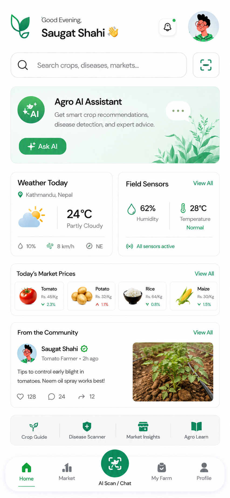 | 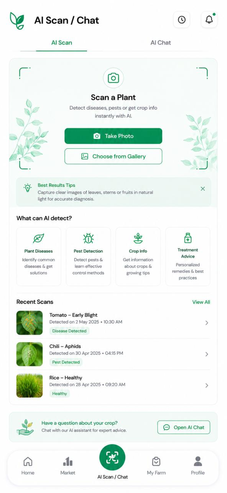 | 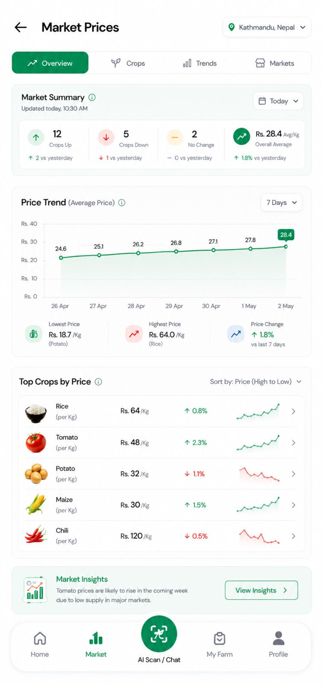 |

| Login | Signup | Profile |
|---|---|---|
| 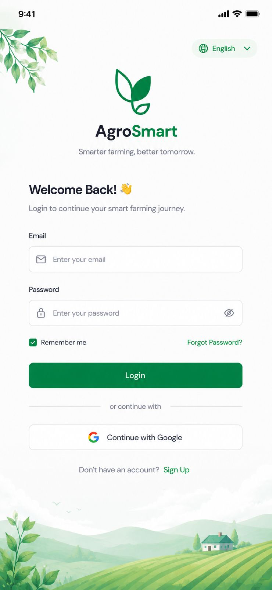 | 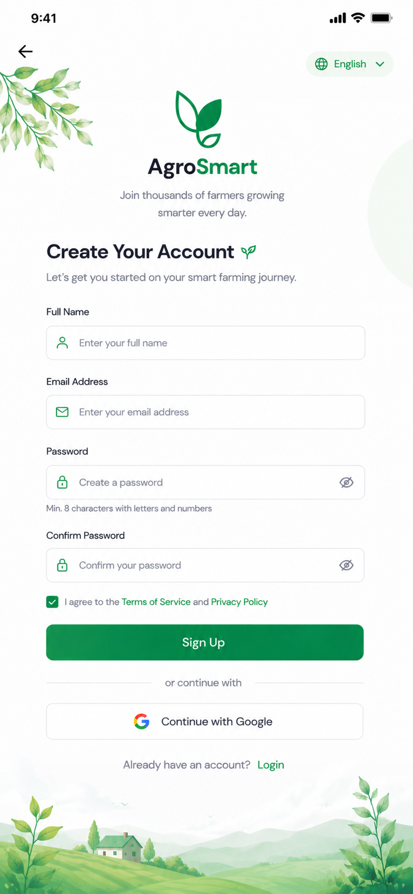 | 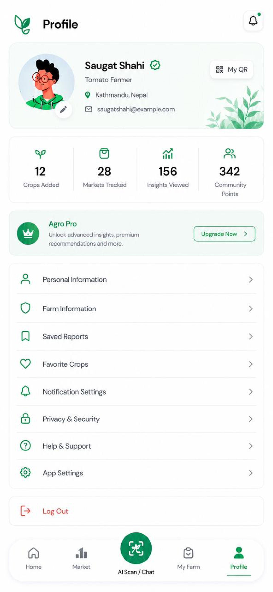 |

| Sensors | News | B2B |
|---|---|---|
| 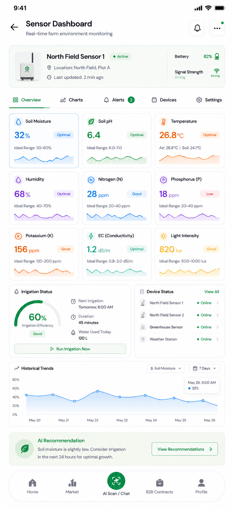 | 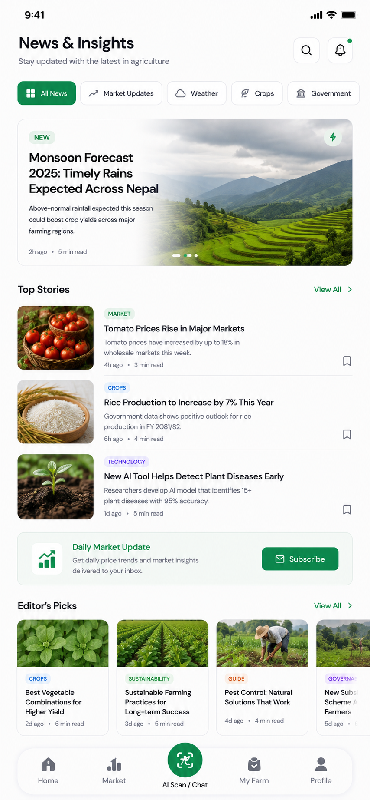 | 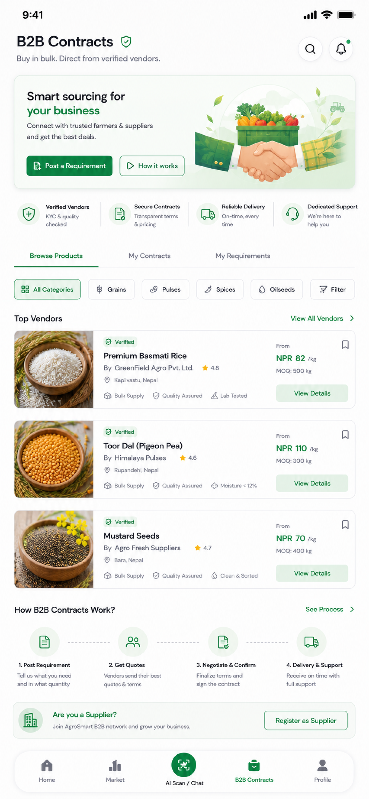 |

<details>
<summary>More screens</summary>

| Chat | Search | Notifications |
|---|---|---|
| 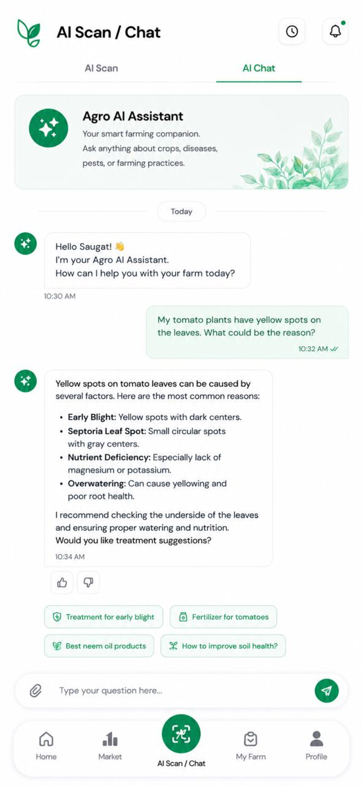 | 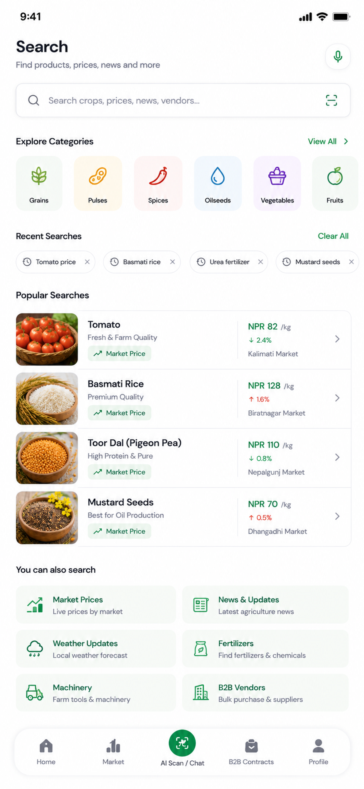 | 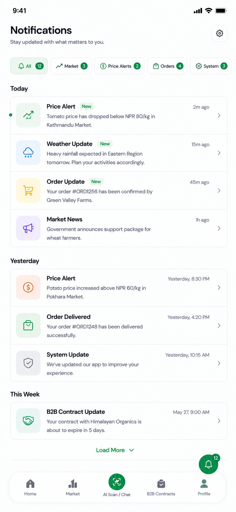 |

| Contacts | Crop Description |
|---|---|
| 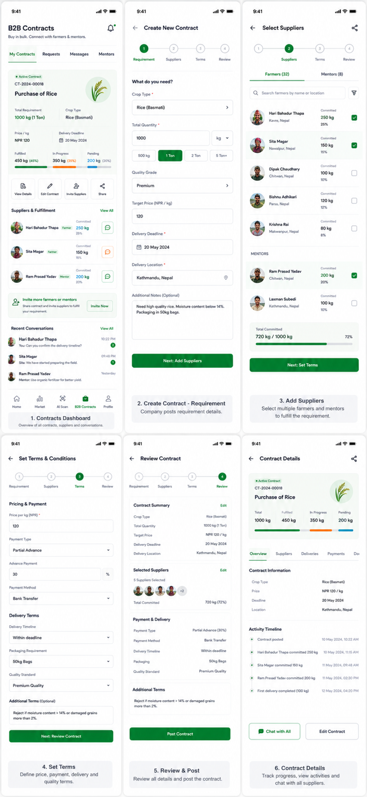 | 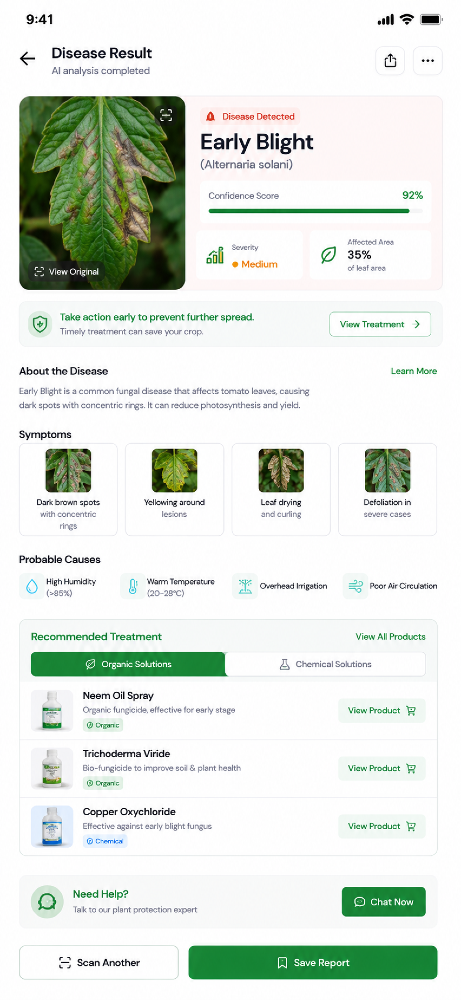 |

</details>

## 🛠️ Tech Stack

- **Framework:** [Flutter](https://flutter.dev/) (Dart SDK `^3.12.2`)
- **Platforms:** Android, iOS, Web
- **Linting:** `flutter_lints`

## 🚀 Getting Started

### Prerequisites

- [Flutter SDK](https://docs.flutter.dev/get-started/install) installed and configured
- Android Studio / Xcode (for mobile builds) or a Chrome-based browser (for web)

### Installation

```bash
# Clone the repository
git clone https://github.com/<your-username>/agro-app.git
cd agro-app

# Install dependencies
flutter pub get

# Run the app
flutter run
```

To target a specific platform:

```bash
flutter run -d chrome    # Web
flutter run -d android   # Android
flutter run -d ios       # iOS
```

## 📁 Project Structure

```
agro_app/
├── lib/              # App source code (entry point: main.dart)
├── android/          # Android platform code
├── ios/               # iOS platform code
├── web/               # Web platform code
├── UI/                # Design mockups / screenshots
├── test/              # Widget/unit tests
└── pubspec.yaml       # Project dependencies & metadata
```

## 🧭 Roadmap

- [ ] Implement navigation shell (Home, Market, AI Scan/Chat, My Farm, Profile)
- [ ] Integrate AI model/API for disease & pest detection
- [ ] Connect live market price data source
- [ ] Wire up authentication (login/signup)
- [ ] Field sensor data integration
- [ ] Community feed & B2B marketplace backend

## 🤝 Contributing

Contributions, issues, and feature requests are welcome. Feel free to open a pull request or issue.

1. Fork the project
2. Create your feature branch (`git checkout -b feature/amazing-feature`)
3. Commit your changes (`git commit -m 'Add some amazing feature'`)
4. Push to the branch (`git push origin feature/amazing-feature`)
5. Open a Pull Request

## 📄 License

No license has been specified yet. Add a `LICENSE` file to define how others can use this project.
